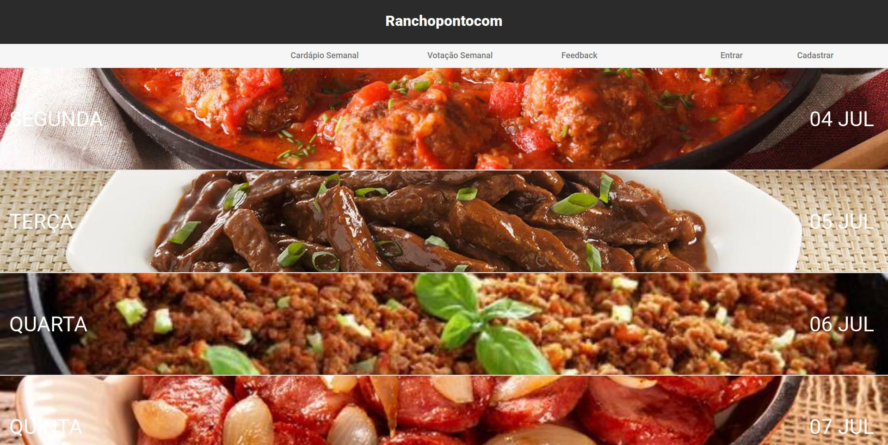
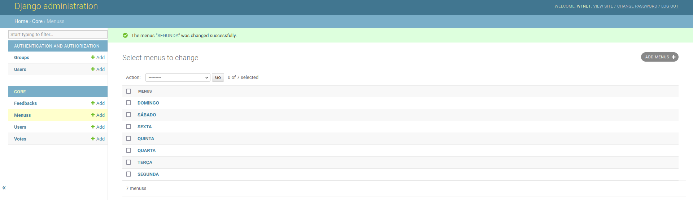
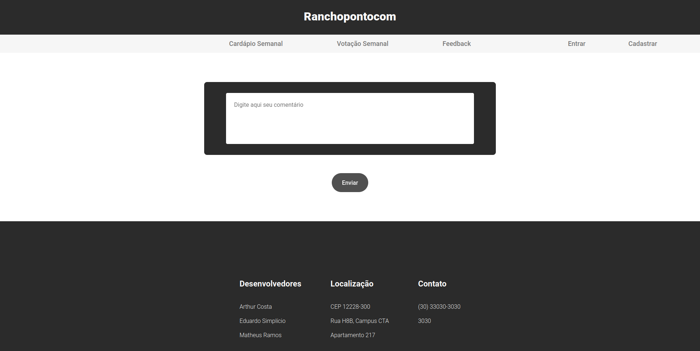

# Ranchopontocom

---

This is a website, created as an assignment for the conclusion of the CES-22 OOP course from the Aeronautics Institute of Technology (ITA), Brazil,
was designed with the student's dining hall, popularly called "rancho", in mind. It aims to group all the important information related
to it, such as the weekly menu, and the announcements made, as well as offer some extra functionality, such as the possibility to perform polls, in
order to, for example, decide on the menu for a certain day, according to popular opinion.

## Backend

---

The backend of the website was written entirely using Python, and made heavy use of the Django library. This specific library has several features that make it quicker for a website to reach the stage of deployment, such as a dedicated administrative system, as well as the possibility to dynamically decide on the amount of pages of the website, and how they are distributed.

The data used in the website is kept in a MongoDB database, which is stored in one of their own clusters. The data is stored in a JSON format, which makes for quick access to both the entries, as well as the data that is contained within them. Since the format of the stored data is dependent on its specification in the code, it should also be very easy to change, which is the case with MongoDB, and was one of the reasons the developers opted for it.

## Frontend

---

In order to have great visuals, that are pleasing to the viewers, the website's developers opted for using the React JavaScript Library, which offers
ample functionality in the form of different transitions, animations, layouts, and more. As previously specified, the frontend was written using JavaScript, as well as CSS, to define the style of each page.

In certain pages, the frontend communicates with the backend in order to show a dynamic set of images, that can be altered without changes on the
website's source code, since this would be highly impractical in a real-world deployment scenario. The dynamic images were achieved by using references to images provided by the backend, which are stored in the database, which the administrator can control while the website is live.

Lastly, in order to enforce security of the accounts, password hashes were also implemented, using the BCrypt, which is a JavaScript Library that has extensive features, which include functions designed to hash and compare passwords.

## URLs of the images that are in the website

Pizza -> https://s.calendarr.com/upload/datas/pi/zz/pizza_c.jpg?auto_optimize=low&width=640

Ice cream -> https://img.itdg.com.br/tdg/images/blog/uploads/2022/03/sorvete.jpg

The others are in the folder reactapp/urls.json
